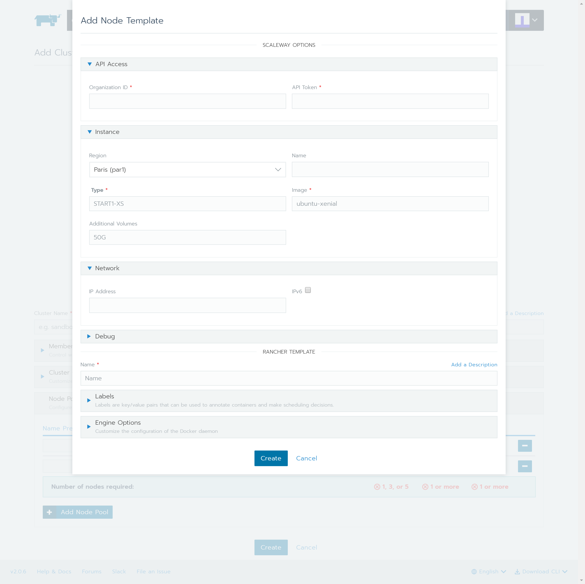

# Rancher 2 UI driver for Scaleway
Rancher 2 UI driver for scaleway docker-machine driver.

## Development

This package contains a small web-server that will serve up the custom driver UI at `http://localhost:3000/component.js`.  You can run this while developing and point the Rancher settings there.
* `npm start`
* The driver name can be optionally overridden: `npm start -- --name=DRIVERNAME`
* The compiled files are viewable at http://localhost:3000.
* **Note:** The development server does not currently automatically restart when files are changed.

## Building

For other users to see your driver, you need to build it and host the output on a server accessible from their browsers.

* `npm run build`
* Copy the contents of the `dist` directory onto a webserver.
  * If your Rancher is configured to use HA or SSL, the server must also be available via HTTPS.

## Using

* Add a Machine Driver in Rancher 2.0 (Global -> Node Drivers)
  * Download URL: The URL for the driver binary (e.g. `https://github.com/scaleway/docker-machine-driver-scaleway/releases/download/v1.3/docker-machine-driver-scaleway_1.3_linux_amd64.tar.gz`) (`https://github.com/scaleway/docker-machine-driver-scaleway/releases`)
  * Custom UI URL: The URL you uploaded the `dist` folder to, e.g. `https://cdn.jsdelivr.net/gh/k-wojcik/ui-driver-scaleway@2.0/dist/component.js`)
* Wait for the driver to become "Active"
* Go to Clusters -> Add Cluster, your driver and custom UI should show up.
